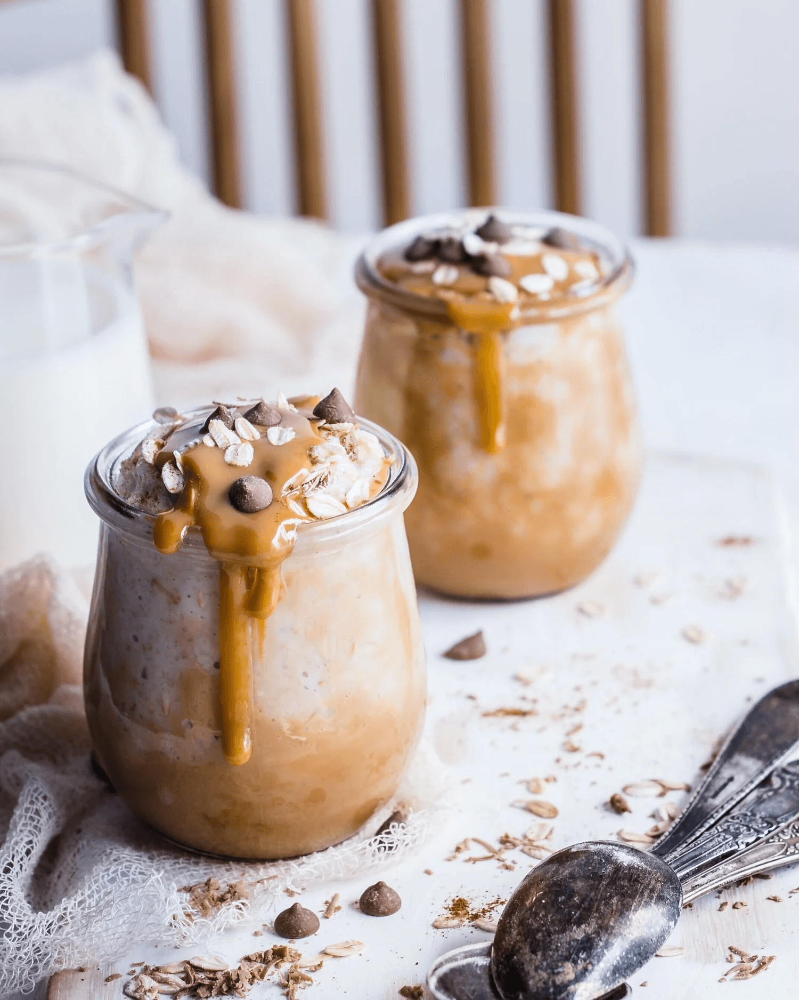

<!-- source: https://ketointhecity.com/blog/keto-recipe-peanut-butter-cup-chia-pudding -->

# KETO RECIPE: Peanut Butter Cup Chia Pudding

---

I love adding nut butter to my chia pudding for a quick and easy way to change the flavor and make it feel even more decadent. Topped with some cacao nibs or sugar-free chocolate chips, this dessert feels naughty even though it is full of nutritional benefits and quality fats. To easily separate the coconut cream from coconut milk, chill a can of coconut milk in the refrigerator and open it without shaking.

### INGREDIENTS

- 1 cup unsweetened full-fat coconut cream
- 2 tablespoons low-sugar nut butter or peanut butter
- 1 tablespoon erythritol (I use [Swerve](https://www.amazon.com/dp/B01LLMUG22?ref=exp_ketointhecity__dp_vv_d))
- Pinch cinnamon
- 1 teaspoon vanilla extract
- 1/4 cup chia seeds
- 1 tablespoon cacao nibs or sugar free chocolate chips

### DIRECTIONS

1. In a food processor or blender, process the coconut cream, nut butter, erythritol, cinnamon, and vanilla until the mixture starts to thicken. Fold in the chia seeds.
2. Pour the mixture into four small glasses or bowls, and cover and refrigerate overnight or up to 3 days before serving.
3. Top with cacao nibs or sugar free chocolate chips and serve.

---

+-------------+---------------------------------------------------------------+
| **Metadata**                                                                |
+-------------+---------------------------------------------------------------+
| title       | KETO RECIPE: Peanut Butter Cup Chia Pudding                   |
+-------------+---------------------------------------------------------------+
| description | I love adding nut butter to my chia pudding for a quick and easy way to change the flavor and make it feel even more decadent. Topped with some cacao nibs or sugar free chocolate chips, this dessert feels naughty even though it is full of nutritional benefits and quality fats. |
+-------------+---------------------------------------------------------------+
| image       | ./images/46d8684350147878c87d0959c4d1d2e4.png                  |
+-------------+---------------------------------------------------------------+
| author      | Jen Fisch                                                     |
+-------------+---------------------------------------------------------------+
| date        | 2021-11-01                                                    |
+-------------+---------------------------------------------------------------+
| tags        | Breakfast, Dessert                                            |
+-------------+---------------------------------------------------------------+
| template    | blog-article                                                  |
+-------------+---------------------------------------------------------------+
