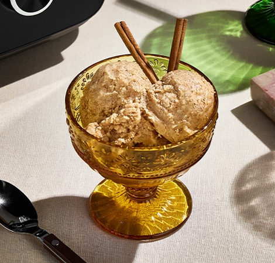

<!-- source: https://www.vitamix.com/us/en_us/recipes/cinnamon-nice-cream -->

+-----------------------------------------------------------------------+
| **Hero-Recipe**                                                       |
+-----------------------------------------------------------------------+
|               |
|                                                                       |
| # Cinnamon N'ice Cream                                                |
|                                                                       |
| Cinnamon and oat milk give this n'ice cream a bold flavor.            |
|                                                                       |
| **Total Time:** 5 Minutes | **Yield:** 6 servings | **Difficulty:** Simple |
|                                                                       |
| Vegan, Vegetarian, Gluten-Free, High Fiber, Low Sodium, Heart Friendly, Diabetes Friendly |
|                                                                       |
| *Submitted by: Vitamix*                                               |
+-----------------------------------------------------------------------+

---

## Ingredients

- 1 cup (240 ml) oat milk
- 2 Tablespoons (15 g) ground cinnamon
- 2 Tablespoons (30 ml) maple syrup, optional
- 1 pound (454 g) frozen bananas

## Directions

1. Place all ingredients into the Vitamix container in the order listed and secure the lid.
2. Run the Frozen Dessert Program or start the blender on its lowest speed, then quickly increase to its highest speed. Blend for 30–40 seconds, using the tamper to push ingredients toward the blades.
3. In about 25–35 seconds, the sound of the motor will change and four mounds should form. Stop the machine. Do not overmix or melting will occur. Serve immediately.

### Nutrition

+---------------------------+---------------------------+
| **Table-Nutrition (no-header)**                       |
+---------------------------+---------------------------+
| Serving Size              | 1 serving (127 g)         |
+---------------------------+---------------------------+
| Calories                  | 120                       |
+---------------------------+---------------------------+
| Total Fat                 | 0g                        |
+---------------------------+---------------------------+
| Total Carbohydrate        | 31g                       |
+---------------------------+---------------------------+
| Dietary Fiber             | 5g                        |
+---------------------------+---------------------------+
| Sugars                    | 17g                       |
+---------------------------+---------------------------+
| Protein                   | 1g                        |
+---------------------------+---------------------------+
| Cholesterol               | 0mg                       |
+---------------------------+---------------------------+
| Sodium                    | 0mg                       |
+---------------------------+---------------------------+

---

+--------------------+---------+
| **Section Metadata**         |
+--------------------+---------+
| Style              | dark    |
+--------------------+---------+

+-----------------------------------------------------------------------+-----------------------------------------------------------------------+
| **Cards-Cta**                                                                                                                                 |
+-----------------------------------------------------------------------+-----------------------------------------------------------------------+
| *Share the Result*                                                    | *Share Your Fav Recipes*                                              |
|                                                                       |                                                                       |
| ## Did You Make It?                                                   | ## Create Your Recipe Book                                            |
|                                                                       |                                                                       |
| **[Rate the Recipe](#)**                                              | **[Sign Up Now](/us/en_us/customer/account/create)**                  |
+-----------------------------------------------------------------------+-----------------------------------------------------------------------+

---

*Explore Vitamix Products*

## Performance That Delivers

**[Shop Now](/us/en_us/shop)**

+-----------------------------------------------------------------------+-----------------------------------------------------------------------+
| **Cards**                                                                                                                                     |
+-----------------------------------------------------------------------+-----------------------------------------------------------------------+
|  | **[Blenders](/us/en_us/shop/blenders)** |
+-----------------------------------------------------------------------+-----------------------------------------------------------------------+
|  | **[Food Processing](/us/en_us/shop/food-processing)** |
+-----------------------------------------------------------------------+-----------------------------------------------------------------------+
|  | **[Containers & Accessories](/us/en_us/shop/accessories)** |
+-----------------------------------------------------------------------+-----------------------------------------------------------------------+
|  | **[Compact Food Recycling](/us/en_us/shop/foodcycler-fc-50)** |
+-----------------------------------------------------------------------+-----------------------------------------------------------------------+

---

+--------------------+------------------------------------------------------+
| **Metadata**                                                              |
+--------------------+------------------------------------------------------+
| Title              | Cinnamon N'ice Cream                                 |
+--------------------+------------------------------------------------------+
| Description        | Cinnamon and oat milk give this n'ice cream a bold flavor. |
+--------------------+------------------------------------------------------+
| Image              | ./images/cinnamon-nice-cream.png                     |
+--------------------+------------------------------------------------------+
