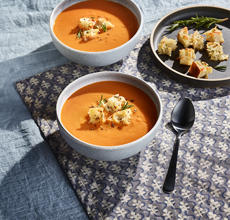

<!-- source: https://www.vitamix.com/us/en_us/recipes/tuscan-tomato-white-bean-soup -->

# Tuscan Tomato White Bean Soup

Puréed to perfection, white beans lend creaminess to this soup, which is best enjoyed with homemade croutons.

**Total Time:** 1 Hour 4 Minutes | **Yield:** 8 servings | **Difficulty:** Intermediate

High Protein, High Fiber, Vegetarian

*Submitted by: Vitamix*

---

## Ingredients

**Soup:**

- 3 Tablespoons (45 ml) extra virgin olive oil
- ½ small (60 g) onion, peeled, halved
- 5 (15 g) garlic cloves, peeled
- 1 teaspoon salt, optional
- 2 Tablespoons (30 ml) tomato paste
- 2 pound (900 g) Roma tomatoes
- 2 (850 g) cans white beans, drained, rinsed
- 4 cups (960 ml) vegetable broth
- 1 sprig fresh rosemary, picked
- ¼ teaspoon red pepper flakes

**Crouton Garnish, optional:**

- 4 (114 g) ciabatta bread, cubed
- ¼ cup (55 g) mozzarella cheese, shredded
- 1 Tablespoon fresh rosemary, chopped

---

## Directions

1. Heat 1 tablespoon of the oil in a large pot or Dutch oven over medium-high heat. Add the onion, garlic, and a pinch of salt. Cook, stirring occasionally, until the onion is softened, about 5 minutes. Add the tomato paste and cook for 1 minute. Add the tomatoes, beans, broth, rosemary, and red pepper flakes. Bring to a boil. Reduce the heat to medium and simmer for 20 minutes.
2. Working in batches, carefully ladle the stovetop soup into the Vitamix container and secure the lid.
3. Start the blender on its lowest speed, then increase to its highest speed. Blend for 20 seconds or until desired consistency is reached. Pour into a pot to keep warm. Repeat with leftover soup from the stovetop.

---

## Nutrition

| Nutrient | Amount |
|----------|--------|
| Serving Size | 1 serving (387 g) |
| Calories | 240 |
| Total Fat | 7g |
| Total Carbohydrate | 33g |
| Dietary Fiber | 11g |
| Sugars | 7g |
| Protein | 11g |
| Cholesterol | 5mg |
| Sodium | 500mg |
| Saturated Fat | 1.5g |

---

| Metadata | |
|----------|--------|
| Title | Tuscan Tomato White Bean Soup |
| Description | Puréed to perfection, white beans lend creaminess to this soup, which is best enjoyed with homemade croutons. |
| Image | ./images/tuscan-tomato-white-bean-soup.png |
